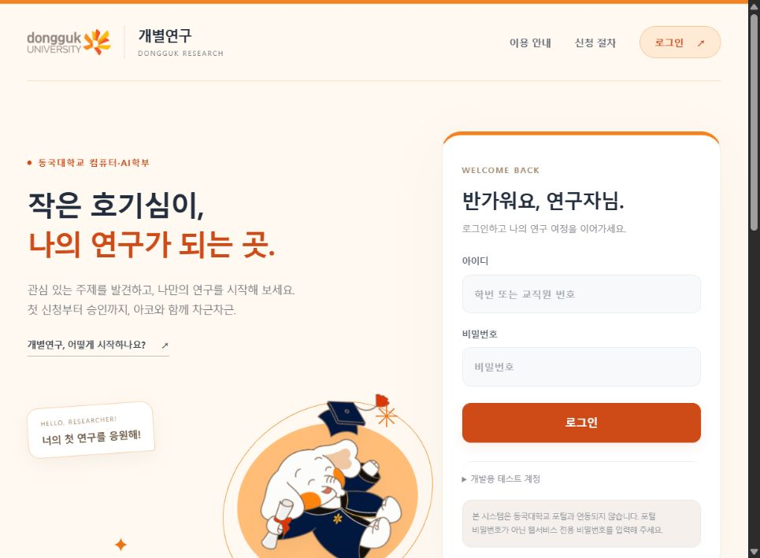
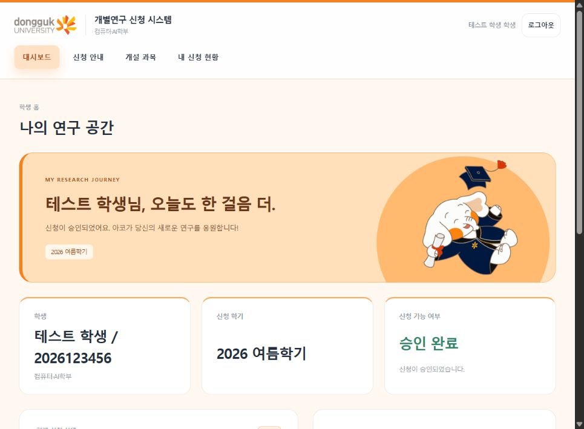
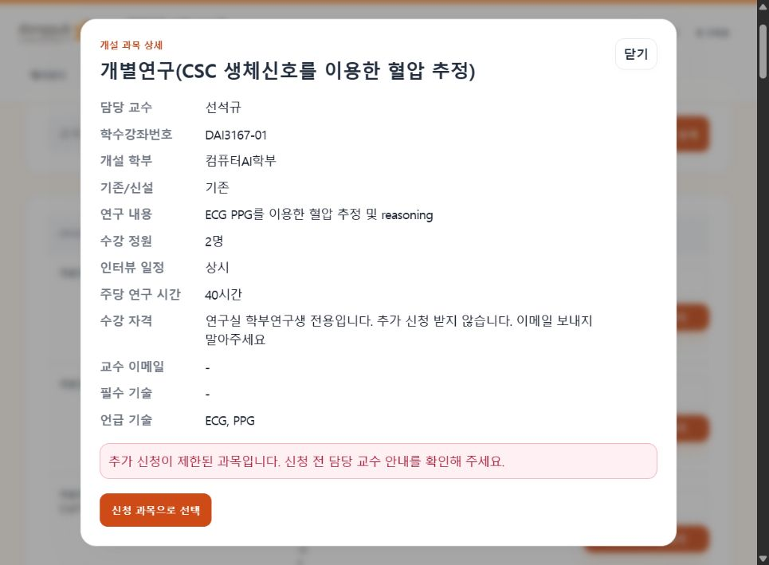
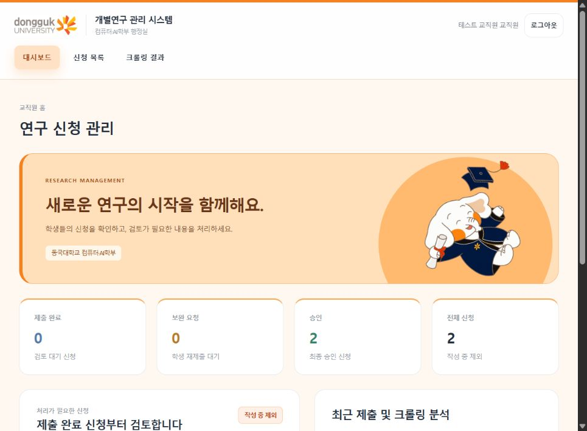
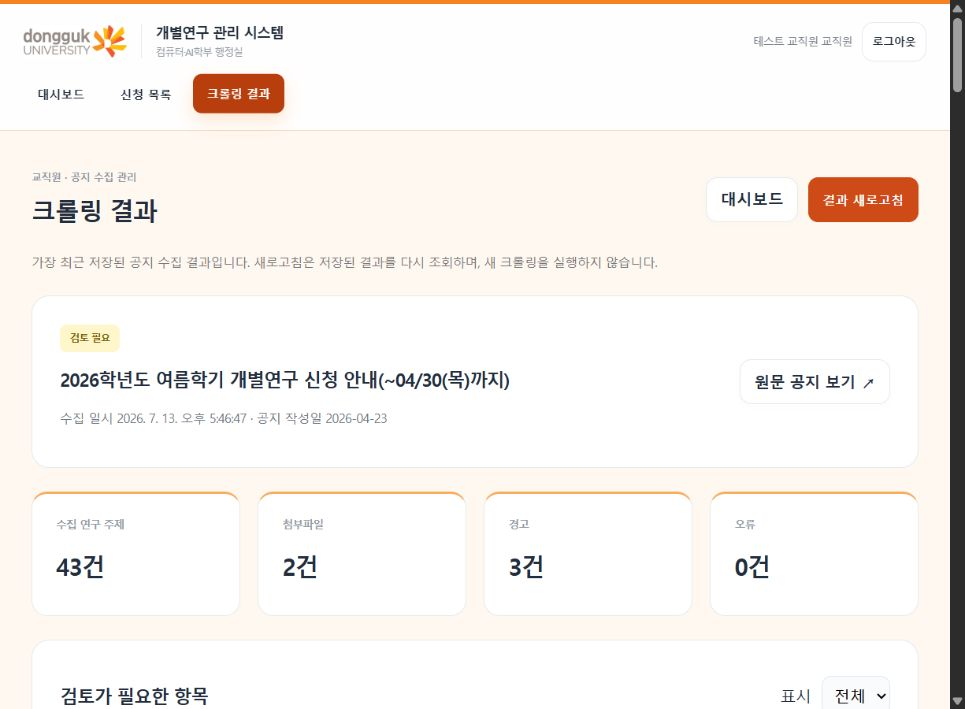
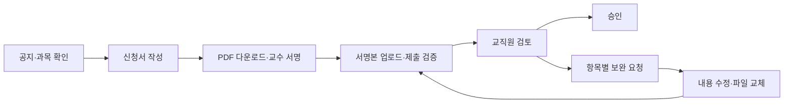
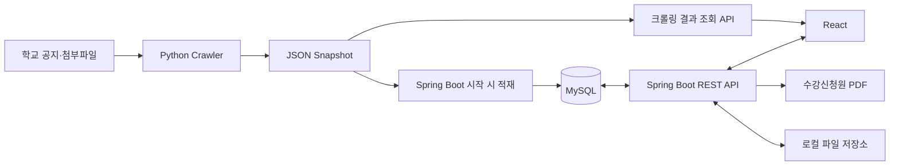

<div align="center">


# 동국대학교 개별연구 신청 시스템

**작은 호기심이, 나의 연구가 되는 곳.**

공지 확인부터 신청서 작성, 교수 서명본 제출, 보완 및 승인까지.<br />
학생과 교직원의 개별연구 신청 과정을 하나의 웹서비스로 연결합니다.

[주요 기능](#주요-기능) · [화면 둘러보기](#화면-둘러보기) · [시작하기](#시작하기) · [API 안내](docs/API.md)




</div>

## 프로젝트 소개

동국대학교 컴퓨터·AI학부 개별연구 신청 업무를 지원하는 개인 연구 프로젝트입니다. 학교 공지와 첨부파일에서 신청 일정·제출 요건·개설 과목을 수집하고, 학생의 신청서 작성과 교직원의 검토를 연결합니다.

동국대학교의 주황색과 아코 마스코트를 활용했으며, 학생과 교직원에게 역할별 화면을 제공합니다. **학교 포털과 연동되지 않는 독립적인 로컬 웹서비스**입니다.

## 주요 기능

### 학생

- **공지·연구 주제 탐색** — 신청 일정과 제출 요건 확인, 교수·과목 검색, 연구 내용 상세 조회
- **신청서 작성** — 등록된 학생 정보와 학년, 신청 과목의 학년도·학기 자동채움
- **초안 저장** — 신청사유·연구목적·관련 경험·연구 계획·면담 질문 작성 및 초안 복원
- **수강신청원 PDF** — 작은 본문 글씨, 주황색 포인트, 날짜·교수 서명란을 담은 A4 양식
- **제출 파일 관리** — 교수 서명본 업로드, 다운로드·교체·삭제, 제출 전 필수값 검증
- **보완 및 재제출** — 요청받은 입력칸으로 바로 이동해 수정하고 저장 후 재제출; 보완 중 제출 파일 교체 가능
- **승인 결과 확인** — 대시보드 알림과 신청 현황에서 승인 상태·처리 일시 확인

### 교직원

- **신청 현황 관리** — 제출 완료·보완 요청·승인 통계와 최근 신청 확인
- **신청서 검토** — 학생 이름·학번 검색, 상태 필터, 신청 상세 및 제출 파일 확인
- **선택적 보완 요청** — 수정할 항목과 사유 지정, 기존 신청 내용 유지
- **최종 승인** — 제출 완료 신청 승인, 처리자·처리 시각 기록
- **크롤링 결과 확인** — 원문 공지, 추출 근거, 첨부파일 분석 상태, 연구 주제 검색
- **경고 상세 확인** — 문제가 된 교수·과목·실제 값 표시, 누락값 강조, 중복 연구 항목 비교

### 수집·데이터 처리

- Python Crawler로 공지와 XLSX·HWP 첨부파일을 수집하고 JSON Snapshot 저장
- 일정·제출 방식·연구 주제를 추출하고 누락·중복 항목을 경고로 분류
- Backend 시작 시 공지·과목 적재, 같은 공지·순번의 과목 ID 유지
- 기존 신청서의 과목 연결이 끊어진 경우, 저장된 초안이 하나의 과목을 명확히 식별할 때만 복구

## 화면 둘러보기

아래 이미지는 개발용 테스트 계정으로 실행한 실제 화면입니다. 신청 건수와 상태는 촬영 시점의 데이터입니다.

| 학생 대시보드 | 개설 과목 상세 |
| :---: | :---: |
|  |  |
| 신청 상태와 승인 알림 | 연구 주제 검색과 상세 확인 |

| 교직원 대시보드 | 크롤링 결과 |
| :---: | :---: |
|  |  |
| 신청 통계와 검토 대상 확인 | 수집 현황과 검토 경고 확인 |

## 신청과 검토 흐름



| 상태 | 의미 | 가능한 작업 |
| --- | --- | --- |
| `DRAFT` | 작성 중 | 입력값 수정, 파일 관리, 임시 신청서 삭제, 제출 |
| `SUBMITTED` | 제출 완료 | 학생은 결과 확인, 교직원은 검토·보완 요청·승인 |
| `REVISION_REQUESTED` | 보완 요청 | 지정 입력칸 수정, 제출 파일 교체·삭제, 재검증·재제출 |
| `APPROVED` | 승인 완료 | 승인 결과와 일시 확인 |

교직원 검토 화면에는 작성 중인 신청서를 표시하지 않습니다. 현재 업무 흐름은 **승인 또는 보완 요청**으로 구성됩니다.

## 기술 구성

| 영역 | 기술·도구 | 역할 |
| --- | --- | --- |
| Frontend | React 18, JavaScript, Vite 6, HTML, CSS | 역할별 화면, API 연동, 신청 단계 및 입력 상태 관리 |
| Backend | Java 17, Spring Boot 3.3, Spring JDBC, Gradle | 인증, 신청·검토, 파일 관리, 데이터 적재 |
| Database | MySQL | 사용자, 공지, 과목, 신청서, 처리 기록, 파일 메타데이터 |
| Crawler | Python 3.10+, lxml | 공지 수집, XLSX·HWP 분석, JSON Snapshot 생성 |
| PDF | Thymeleaf, OpenHTMLToPDF, PDFBox | HTML 기반 한글 PDF 출력 및 검증 |
| Test | JUnit 5, Spring Boot Test, Mockito, H2, unittest | API·서비스·파일·문서·파서 테스트 |
| Development | Git, GitHub, npm, Gradle Wrapper | 버전 관리와 의존성·빌드 관리 |



## 시작하기

### 준비 사항

- JDK 17, Node.js 20+, npm, Python 3.10+, MySQL
- PDF 출력용 한글 TTF Font
- 아래 명령은 Windows PowerShell 기준입니다. 각 서버는 별도 터미널에서 실행합니다.

### 1. 저장소 받기

```powershell
git clone https://github.com/hayo02/dongguk-individual-research.git
cd dongguk-individual-research
```

### 2. 공지 데이터 수집

저장소에는 수집 결과인 `data/`가 포함되지 않습니다. 프로젝트 루트에서 실행합니다.

```powershell
python -m venv .venv
.\.venv\Scripts\python.exe -m pip install -e .
.\.venv\Scripts\python.exe -m dongguk_notice crawl --category individual-research
```

최신 결과는 `data/snapshots/individual-research/latest.json`에 저장됩니다. 웹사이트 접근이 필요하며, 수집한 파일의 경고·오류는 교직원 화면에서 확인할 수 있습니다.

### 3. MySQL 준비

```sql
CREATE DATABASE individual_research
  CHARACTER SET utf8mb4
  COLLATE utf8mb4_unicode_ci;
```

기본 연결 포트는 `3307`입니다. MySQL이 `3306`에서 실행 중이면 다음 `DB_URL`의 포트를 바꿉니다.

### 4. Backend 실행

```powershell
cd backend
$env:DB_URL='jdbc:mysql://127.0.0.1:3307/individual_research?serverTimezone=Asia/Seoul&useUnicode=true&characterEncoding=utf8'
$env:DB_USERNAME='root'
$env:DB_PASSWORD='your_password'
$env:APP_AUTH_SECRET='replace-with-your-own-long-random-secret'
$env:PDF_FONT_PATH='C:/Windows/Fonts/malgun.ttf'
.\gradlew.bat bootRun
```

기본 주소는 `http://127.0.0.1:8000`입니다. 시작 시 테이블과 개발용 계정을 준비하고 Snapshot을 읽어 공지·과목을 적재합니다. Snapshot이 없으면 기본 안내 공지를 사용하지만, 실제 과목을 확인하려면 수집 데이터를 준비해야 합니다.

### 5. Frontend 실행

새 터미널을 열고 프로젝트 루트에서 실행합니다.

```powershell
cd frontend
npm ci
npm run dev
```

브라우저에서 **http://127.0.0.1:5173**에 접속합니다.

### 환경 설정

| 변수 | 기본값·사용 예 | 설명 |
| --- | --- | --- |
| `DB_URL` | `jdbc:mysql://127.0.0.1:3307/individual_research` | MySQL 연결 URL |
| `DB_USERNAME`, `DB_PASSWORD` | 실행 환경에서 지정 | Database 접속 정보 |
| `APP_AUTH_SECRET` | 실행 환경에서 지정 | 토큰 서명 키 |
| `PDF_FONT_PATH` | `C:/Windows/Fonts/malgun.ttf` | 한글 TTF Font 경로 |
| `STORAGE_ROOT` | `./storage` | Backend 실행 디렉터리 기준 파일 저장소 |
| `APP_NOTICE_SNAPSHOT_PATH` | `../data/snapshots/individual-research/latest.json` | Backend에서 읽을 Snapshot 경로 |
| `VITE_API_BASE_URL` | `http://127.0.0.1:8000` | Frontend의 API 주소; `frontend/.env.local`에서 설정 가능 |

macOS·Linux에서는 `./gradlew bootRun`을 사용하고, 환경 변수 문법과 Font 경로를 운영체제에 맞게 지정합니다. 다른 Frontend 주소를 사용하면 Backend의 `CorsConfig`도 해당 Origin을 허용해야 합니다.

## 테스트 계정

로컬 개발 시 자동 생성되는 계정입니다. 실제 학교 포털 계정과는 별개입니다.

| 역할 | ID | Password | 등록 학년 |
| --- | --- | --- | --- |
| 학생 | `2026123456` | `1234` | 3학년 |
| 학생 | `2027123456` | `1234` | 4학년 |
| 교직원 | `2025123456` | `5678` | 해당 없음 |

학년은 `users.grade`에서, 신청 학년도·학기는 선택한 과목의 공지에서 가져옵니다. 학번으로 학년을 추정하지 않습니다.

## Build 및 Test

각 명령의 실행 위치를 확인해 주세요.

```powershell
# backend/
.\gradlew.bat test
.\gradlew.bat bootJar

# frontend/
npm run build

# 프로젝트 루트
.\.venv\Scripts\python.exe -m unittest discover -s tests -v
```

Backend Test는 H2를 사용합니다. PDF 관련 Test에는 설정된 경로의 한글 Font가 필요하며, 일부 테스트는 Windows의 `malgun.ttf` 경로를 사용합니다. Python의 샘플 파일 분석 Test는 `samples/`에 해당 XLSX·HWP 파일이 있어야 합니다.

## 프로젝트 구조

```text
dongguk-individual-research/
├── backend/
│   └── src/
│       ├── main/java/.../
│       │   ├── auth/           # 인증·권한
│       │   ├── application/    # 신청·검증·제출·파일·PDF
│       │   ├── draft/          # 초안 저장
│       │   ├── staff/          # 교직원 검토·크롤링 결과
│       │   ├── student/        # 학생 대시보드
│       │   ├── notice/         # 공지
│       │   ├── course/         # 개설 과목
│       │   ├── document/       # 기존 문서 생성·템플릿
│       │   └── common/         # 초기 적재·공통 응답·CORS
│       ├── main/resources/templates/  # PDF 양식
│       └── test/               # Backend Test
├── frontend/src/
│   ├── main.jsx                # 신청·검토 화면 및 API 연결
│   ├── ResearchLanding.jsx     # 서비스 소개·로그인
│   ├── CrawlingResults.jsx     # 크롤링 결과·경고 상세
│   ├── styles.css
│   └── research-design.css
├── src/dongguk_notice/          # Python Crawler·Parser
├── tests/                      # Python Test
├── samples/                    # 분석용 샘플 첨부파일
├── design-preview/             # 초기 화면 설계·흐름 참고 자료
├── docs/                       # API 안내·실제 화면 캡처
└── README.md
```

수집 결과는 `data/`, 업로드·생성 파일은 `STORAGE_ROOT`에 저장됩니다. 현재 실행 데이터를 새 환경으로 옮기려면 MySQL과 파일 저장소를 함께 관리해야 합니다.

## 알아두기

- **보완 요청**: 선택한 입력칸만 학생 화면에서 수정하도록 안내합니다. 파일은 보완 요청 상태에서 교체·삭제할 수 있습니다.
- **파일 업로드**: PDF·JPG·JPEG·PNG, 최대 10MB. 교수 서명본은 신청서당 하나이며 새 파일은 교체 기능을 사용합니다.
- **크롤링 새로고침**: 저장된 Snapshot을 다시 읽습니다. 새 공지 수집은 CLI로 실행하고, 과목 Database 반영은 Backend를 재시작합니다.
- **PDF**: A4 한 페이지를 기준으로 정리한 양식입니다. 입력 내용이 매우 길면 잘라내지 않고 다음 페이지로 이어질 수 있습니다. 공식 학교 양식과 동일한 문서는 아닙니다.
- **기존 문서 기능**: HWPX Template 및 일부 HWP·면담자료 API는 코드에 남아 있지만 현재 기본 화면 흐름에는 포함되지 않습니다.
- **운영 범위**: 학교 포털·학적 시스템 연동과 운영 배포는 포함되지 않습니다. 공개 운영 전 개발용 계정·Database 설정·권한 정책·비밀키·파일 저장 방식을 별도로 검토해야 합니다.

자세한 요청 경로, 인증 헤더, 파일 업로드 규칙과 응답 예시는 [API 안내](docs/API.md)를 확인해 주세요.

## 출처와 문서 참고

- 공지 및 연구 주제 출처: [동국대학교 컴퓨터·AI학부](https://cs.dongguk.edu/)
- 로고·아코 이미지 출처 및 가공 내역: [ASSET-SOURCES.md](frontend/public/ASSET-SOURCES.md)
- README 구성 참고: [Excalidraw](https://github.com/excalidraw/excalidraw)

학교 로고와 아코 캐릭터의 권리는 해당 권리자에게 있습니다. 이 저장소에는 별도의 소프트웨어 License 파일이 지정되어 있지 않습니다.
